# 远古的回响：拆解分析老式微波炉计时器总成

> **前排提醒**：多图警告，请注意自己的流量消耗！
>
> **重要警告**：本文拆解和分析行动均在**未接入市电且完全安全**的环境下进行，非专业人士禁止拆解微波炉整机用于研究，否则可能会有触电危险。

我自幼以来就非常喜欢研究各类电子设备（包括父亲的剃须刀，充不进去电的手电筒，旧座机电话，奶奶家里的电子镇流器，旧电磁炉，姥姥的录音机，老爷的收音机等等），而前两天我回想到毕业时期，在宿舍轻松的吃着使用微波炉加热的食品的时光：随着那一声“**叮**”响，我们就知道在微波炉里烹饪的食物已经做好了。我本科阶段的宿舍楼的一楼放置的公共微波炉正是这种机械式计时器的代表。

直到前不久，我突然想到询问AI，才得知原来老式微波炉里这个清脆的响声是由于机械机构发出来的，于是我在某电商平台搜索相关物品，发现真的有结果，随即买了若干个准备拆解研究。

> 事先声明：我本科阶段是**电子信息工程**，这篇文章可能包含部分**机电一体化**相关的内容，如果有不准确的地方，欢迎指出！

首先，这是一张我购买的老式微波炉计时器总成组件的图片，绿色的是标签，中间大块的白色的区域是塑料制作的（在电商平台上我一直以为是陶瓷的），金属片是用来插接导线的，最顶端很明显就是我们听到的“叮”一声响的铃铛，我们放在后面说：

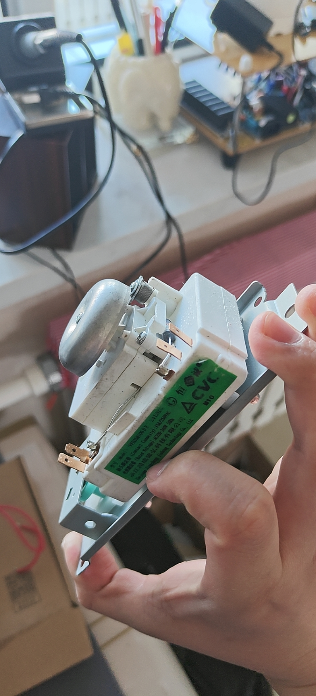

我买了多个计时器，这两款是不同商家的，价格基本差不多，并且看型号应该是可以通用的，这里我随机找了一个拆解，如下图（前面板只有三颗螺丝，将金属框架与塑料组件固定，非常好拆解，如图我已经拆解了部分螺丝了）：

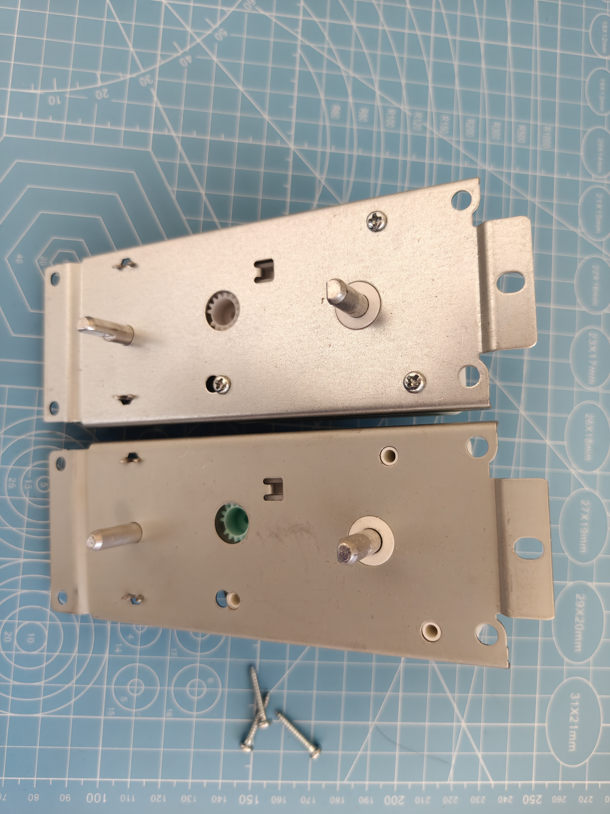

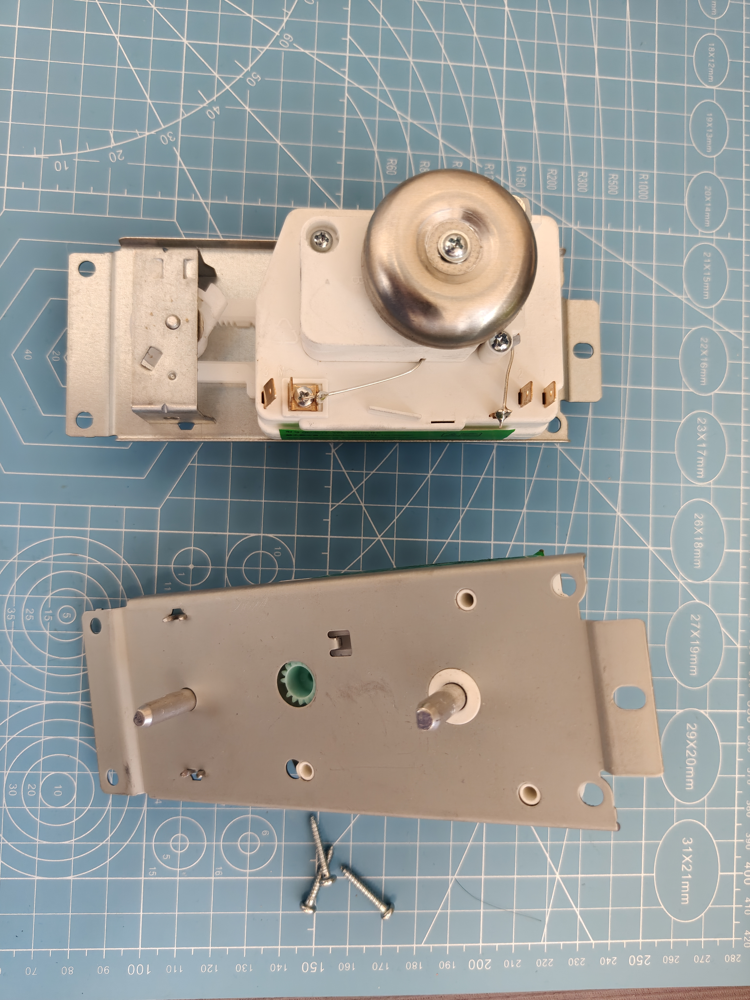

按照图片的角度，左侧是**火力档位选择**旋钮，右侧是**延迟时间设定**旋钮。火力档位是一个“**棘轮机构**”，它由一个规则凹槽的齿轮与带金属触点的弹片组成，如下图：

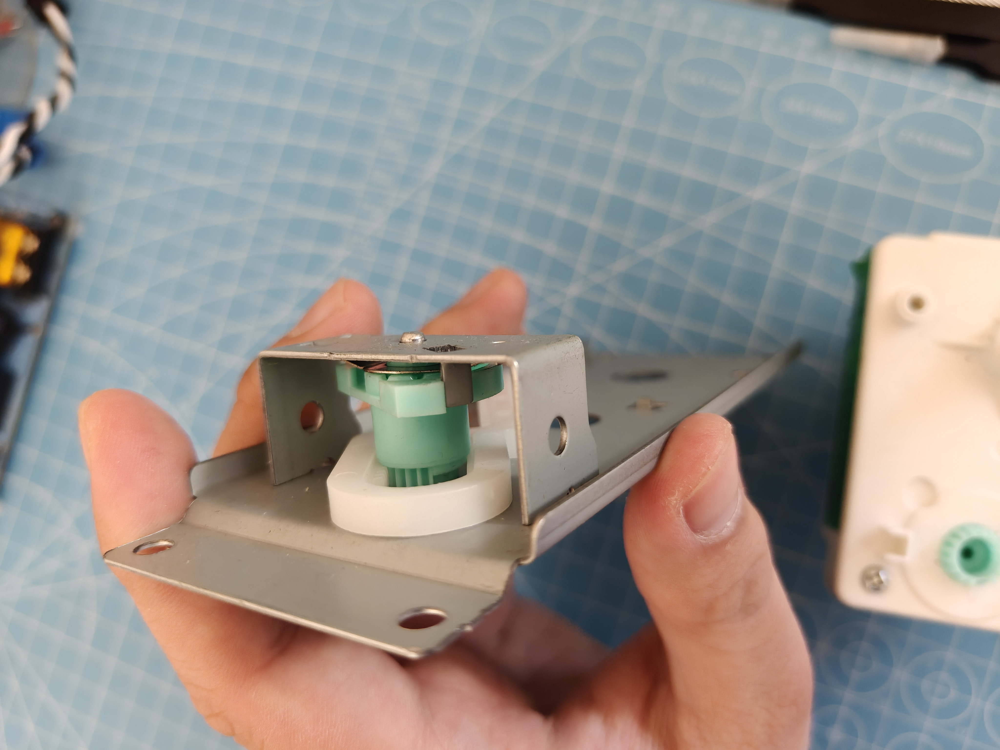

为了方便看清，这里有一张另一个角度的图片：

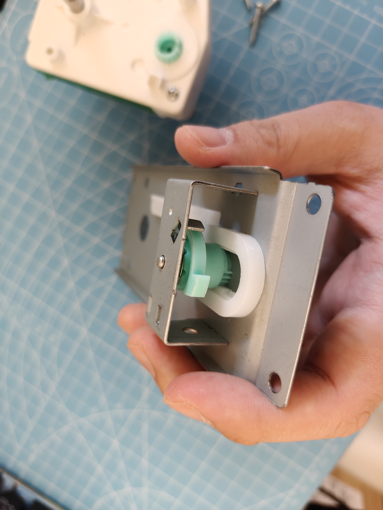

这个角度我们可以注意到更多信息，容我讲解一下：

   - 蓝色齿轮是与用户侧旋钮同轴的，用户旋转旋钮，带动蓝色齿轮转动，这种带有规律凹槽和金属弹片的机构叫做**棘轮定位机构**。**由于棘轮定位机构的存在，齿轮只能在对应的“档位”停下**。那个带有凹槽的齿轮也被叫做**棘轮**，而蓝色齿轮与金属框架中间有一层极其微小的**棘爪**，旋转时弹片的凸点（棘爪）从凹槽滑出，划过齿顶，落入下一个凹槽，落入瞬间产生“咔哒”的声音和触觉反馈。
   - 蓝色齿轮与之相连的白色齿轮，叫做**齿轮齿条机构**，上文的棘轮在此处作为驱动轮的作用，齿条就是将选择的档位“**上传**”给计时器机构的装置，**齿条机构是将旋转运动转换成直线平移运动的关键**。
   - 在蓝色齿轮的靠近棘轮的位置，有一个凸起的塑料块，同样在外壳上也有一个金属片，它是**旋转限位机构**，止动块的作用是**防止机械过行程**，从而防止用户拧出操作面板的指示区域。

从另一个角度，来看看齿条机构与蓝色齿轮的棘轮部分，下图中，我手持的位置是限位块，中间的内侧由一圈棘轮，右侧是对应的弹片，同时还有一个我没讲到的细节，就是在上面的限位块上方的一个“挂钩”，那个其实是齿条机构用来限制齿条上下运动的（可以理解为这是另一个限位器，如果没有的话齿条机构很可能会卡不严，同样齿条的内部也有一条贯穿上下的沿着行程的凹槽）：

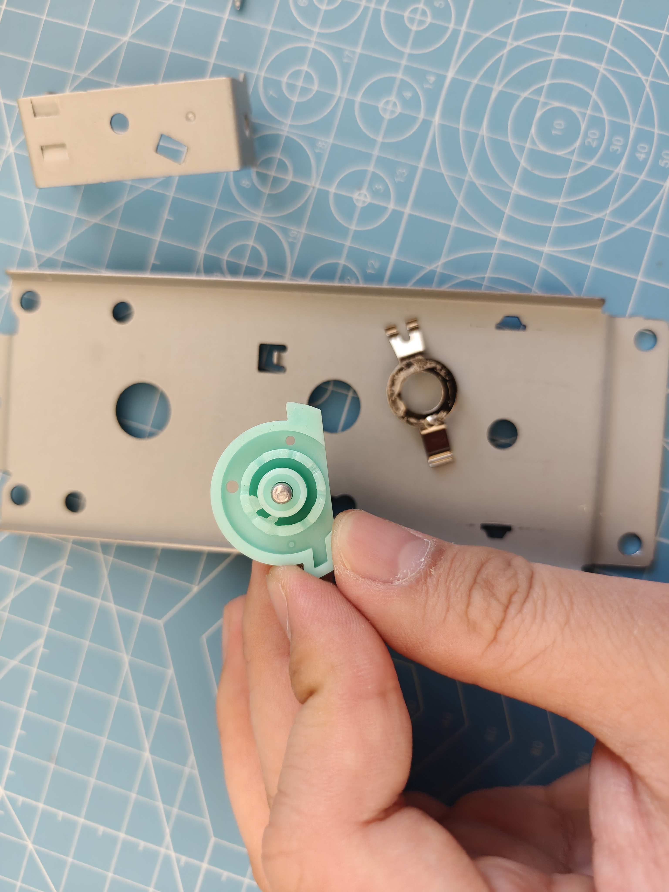

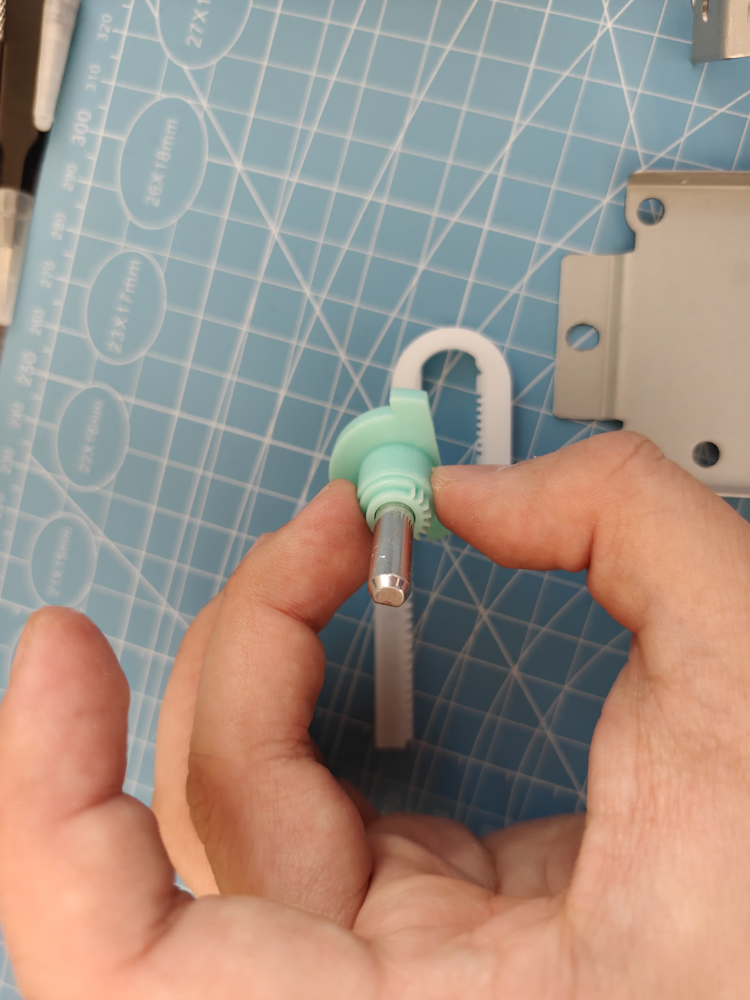

火力档位切换器除了这几个部件以外没有别的什么了，我们来看另外一部分（齿轮箱，同步电机与铃铛）：

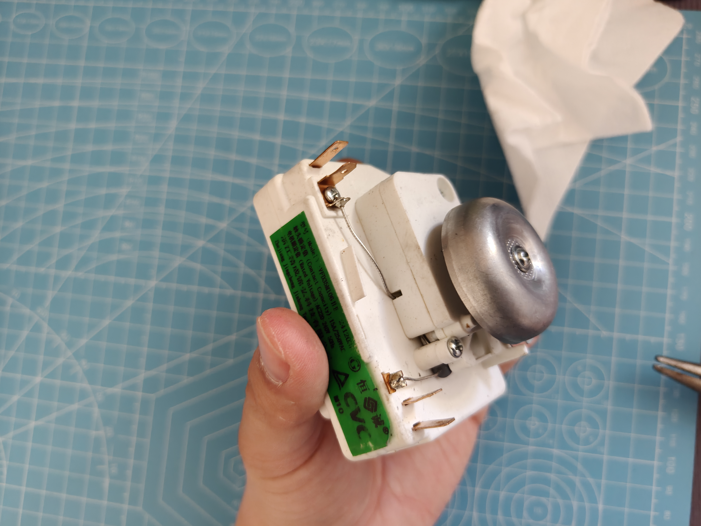

齿轮箱的背面，除了一个计时器手柄，另一个就是刚刚齿条带动的那个齿轮了（下图蓝色齿轮），此处只有一个螺丝（已拆卸）：

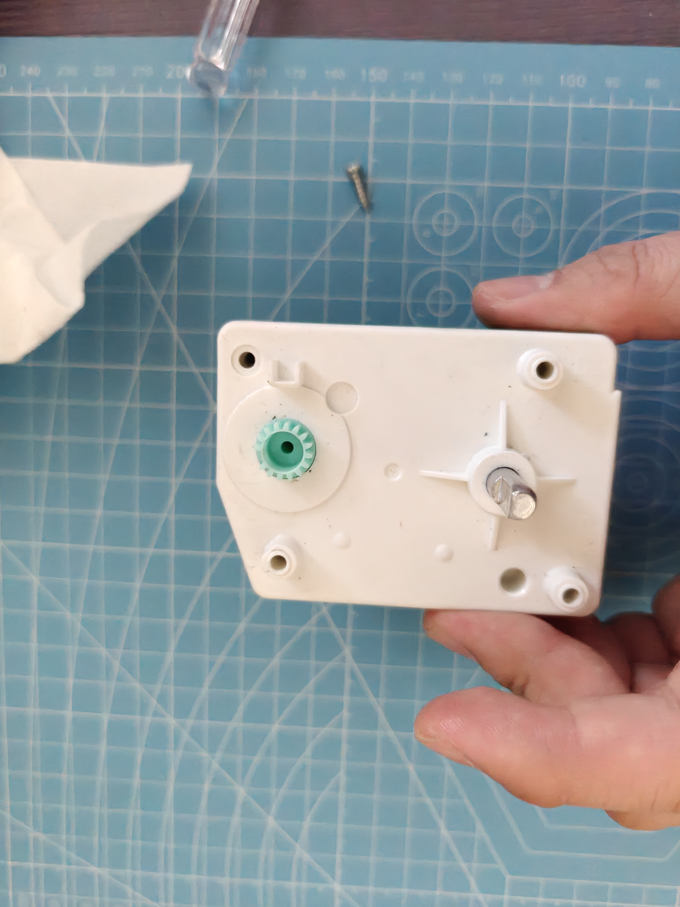

打开盖子，可以看到里面复杂的齿轮箱：

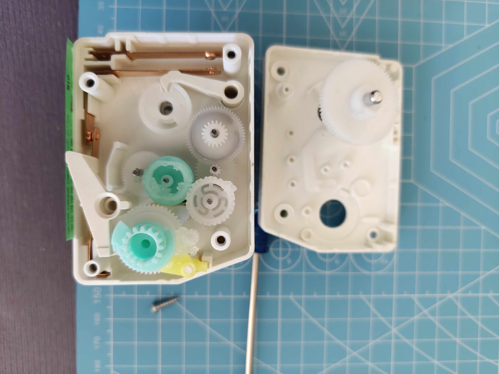

这里又有几个值得注意的地方：

   - *注：由于我拆卸的时候不太小心，齿轮乱了几个，加上里面的润滑油非常粘手，且不易清洗，所以这里我只能根据原理分析和猜测，可以认为是准确的。*
   - 下方蓝色齿轮就是从刚才的齿条机构连接的另一部分，这个齿轮箱除了**减速套组**，还有很多的**凸轮机构**，比如图片上面的一对金属片下方的**缺口轮与随动杆机构**，也属于一种凸轮机构。
   - 蓝色凸轮会根据用户的档位**推动左侧弹片的闭合与断开**，从而控制火力，左和上两侧弹片中间相连的那个弹片应该是**电源输入端（火线）**，内部的电路连接方式相当于共用一组接线的两个开关，其中一个（左侧开关）是通过凸轮与齿轮（可能）控制，另一个（顶端开关）是完全的齿轮控制，当计时器停止时，上方缺口轮动作，在弹片的弹性势能作用下复位，同时带动随动杆，随动杆的动力通过齿轮箱引到外侧，为敲击铃铛做准备。
   - 在左上角，有两个接线端子，最上方的是**固定金属片**，下方的是**供电金属片（火线公共端）**，这个金属片具有弹性，能够自复位，在外壳侧的公共端连接了一个电阻。在左下角，也有两个接线端子，其中一个是左侧开关的另一端，另一个接线端子没有出现在齿轮箱内，它由螺丝拧紧固定，引出另一条线，与带有电阻的那条共同接入同步电机中。

以下是铃铛，铃锤，以及同步电机电阻特写：

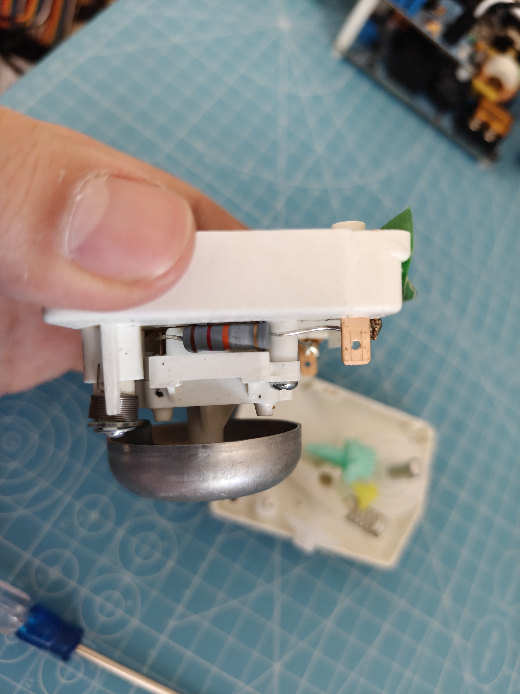

根据尺寸，可以判断这个电阻功率是**1W**，根据颜色可以判断，“棕红橙金”对应的色环电阻阻值是**12KΩ**，误差为±5%，并且它是一个**碳膜电阻**。

上图拇指所在位置的下方是前面提到的随动杆，它连接着一个铃锤，用来敲击铃铛（外侧圆形的金属碗），发出清脆的“**叮**”声响。随动杆上有一个**扭力弹簧**，它的作用是保证敲击铃铛时，铃锤不会因为接触铃铛产生**阻尼**，导致回响过早结束。

下图是拆下铃碗后，铃锤的特写（上方为同步电机的电阻）：

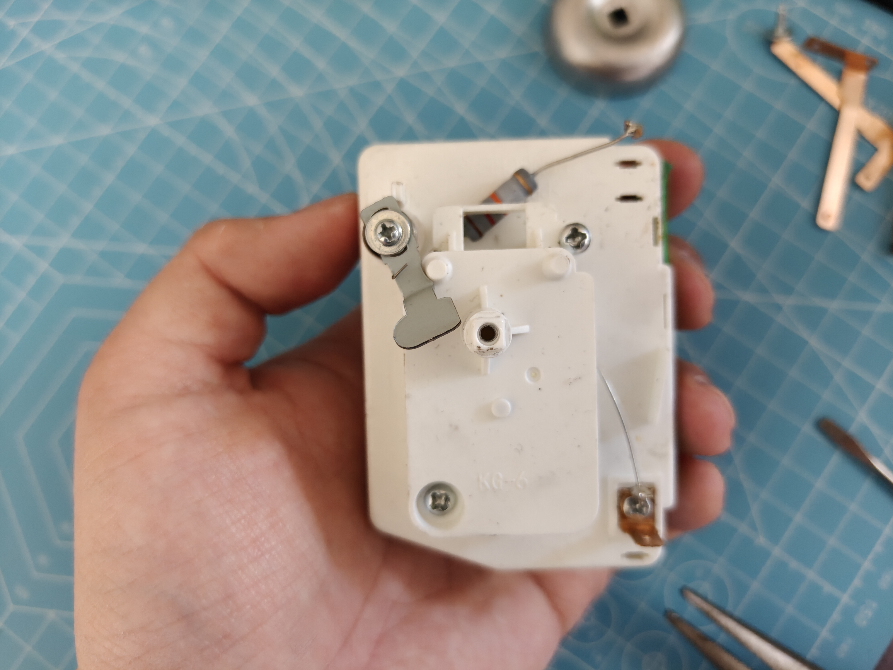

上图可以注意到，齿轮箱与同步电机中间仅靠两枚螺丝固定，所以很轻松就可以拆解：

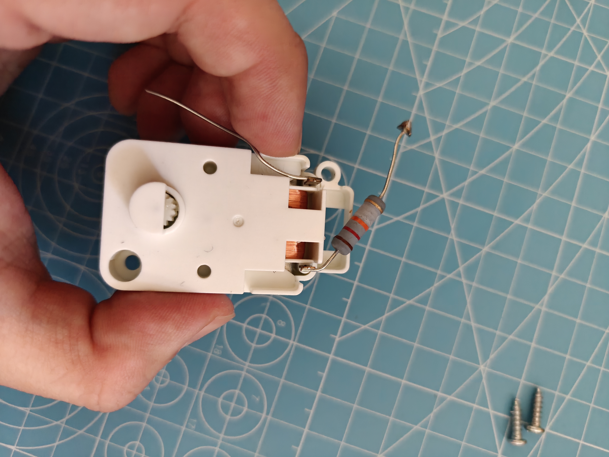

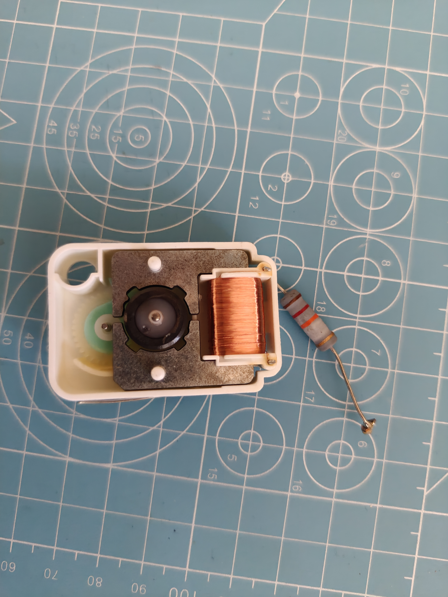

到这里已经基本结束了，所有组件我们都探索一遍了。这里的同步电机的外观酷似一些小型石英钟的机芯的内部：同样的漆包线绕法，同样的铁圈，同样的带永磁体的齿轮（转子），不同的是石英钟的内部是靠晶振产生心跳，通过环氧封装的芯片分频，而微波炉计时器的同步电机，根据标签描述，是可以直接使用220V供电的。

同步电机正是利用交流电的频率特性来计时：交流电**50Hz**对应的就是它的心跳频率，这种恒速动力源与时钟基准可以让计时器以非常精确的方式运行。

在分析了同步电机的原理之后，我想到了洗衣机计时器，洗衣机计时器是我小时候在家电修理铺购买的，它虽然与微波炉计时器看起来相似，都是通过旋转旋钮来计时，但是二者有本质区别：

| 维度 | 微波炉计时器 | 洗衣机计时器 |
| ---- | ----------- | ----------- |
| 动力源 | 主动（**同步电机**，通过**市电频率**计时） | 被动（**发条传动**，通过**擒纵机构**计时） |
| 能量流 | 用户开启开关，设定结束时间，靠同步电机运行自动复位 | 用户为发条蓄能，设定结束时间，通过擒纵机构匀速释放弹性势能 |
| 断电影响 | **立即停止计时** | 继续计时直到结束 |
| 计时精度 | **高**（基于市电频率） | 低（基于发条与擒纵机构） |
| 设计理念 | 维持型计时 | 触发型计时 |

在微处理器（MCU）普及以前，人类工程师利用物理原理的深刻理解，通过硬件为我们设计了计时器“程序”，这是一种非常宝贵的精神，但机电时代（1970s至2010s）很快便离我们远去了，如今的我们面对的是一个又一个的“电子黑箱”，机电时代的可维修性，可理解性，物理交互的满足感，以及工程师们的集体智慧的体现，在如今的屏幕与物理接口间逐渐“抽象化”了，我们不妨停下脚步，去感受和体验机械时代带给我们的那些，正如这篇文章那样，在我拆解后我不仅知道了微波炉计时器的工作原理，更是对各类我曾经从来不知道的机械原理的更深刻的理解。