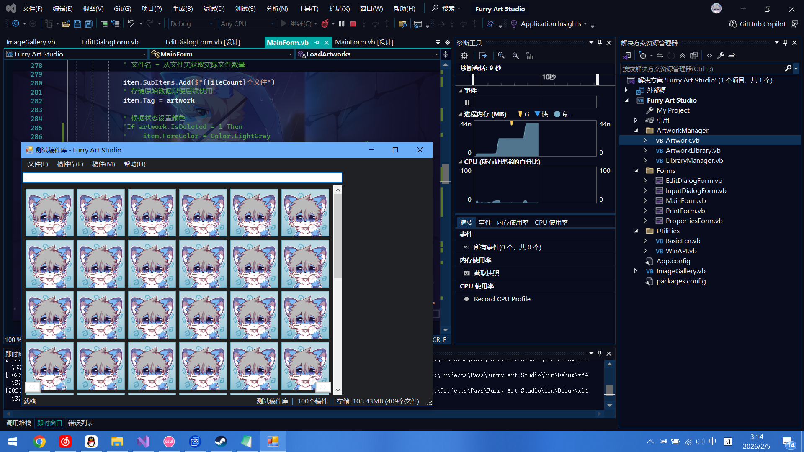

# FAS初代设计：图片墙

非常抱歉这篇博客直到这么久才发表出来。今天是2026年2月22日。

注：本篇可能包含部分AI创作的内容，例如代码等等，使用时请仔细甄别，推荐使用本人开源的最佳实践。

我本人不是很喜欢Vibe Coding，因为我觉得那不是我自己写的代码，我希望我自己能够掌控我的代码，但是由于我编程是爱好，很多地方是我自学的，所以有些代码我很可能完全不知道语法或者相关的概念，而AI提供的代码能够给我一些灵感，甚至有些小众的语言，比如我最常用的`VB.NET`，AI就知道我要写的是什么，所以我始终保持**人工为主，AI为辅**的方式去开发，尤其是一些比较重要的部分。

另一个不使用Vibe Coding的原因，就是我其实不是特别喜欢使用VSCode，我个人觉得**Visual Studio**的设计非常符合我，最主要的一点就是VS能够对VB有很好的支持，**而在VSCode，对不起，VB是啥，请和文本文件坐一桌**。

虽说VB是微软的*曾经的*亲儿子，但是看到微软偏向自家的妹妹（C#），我还是很不甘心，并且我喜欢VB的独特的风格，它字母大写，看起来像英文文章，没有其他语言使用大括号那么抽象，也没有部分语言对缩进敏感，而且本身还更严谨。

从这几个角度来看，Vibe Coding，尤其是**集成在代码编辑器的插件**，不是很适合我，对我来说在网页端询问比直接在编辑器里写更符合我的理念

> *但我后来开始学着使用VSCode，因为它管理纯文本的博客很方便，主要就是这一点，嘿嘿。*

图片墙，虽然我不知道它的学名，但是我知道如果我的Furry Art Studio要是想作为一个**稿件**管理器，而不是单纯的**元数据**管理器，制作图片墙是个无法越过的坎。

这次我的图片墙代码的主要设计者就是AI，首先我要求DeepSeek编写了一个图片墙的代码，但我注意到：DeepSeek的方式是新建一个控件，然后添加多个`PictureBox`组件来拼凑出类似于壁纸引擎或者手机相册的模式，紧接着我遇到的第一个障碍就是：内存不足和句柄上限。报错信息如下：

```text
System.ComponentModel.Win32Exception:“创建窗口句柄时出错。”
```

后来我查询了AI得知，原来Windows操作系统的每个应用能够创建的组件句柄存在上限，当资源不足时，程序会抛出异常，并且这么做的内存也常常很高。

我不知道壁纸引擎是为什么能够做到一页最高100张图片，并且流畅运动，甚至还会播放动图的，这给我一种非常匪夷所思的感觉，随后我问了**ChatGPT**，ChatGPT告诉我：其实壁纸引擎的实现方式是：一个窗口，其他的图片都是“画”出来的。并且壁纸引擎本身也使用了GPU加速，这使得一页存在大量的图片成为可能。

后来我要求ChatGPT编写了一个图片墙，详细的代码请在我的[GitHub](https://github.com/PawLaboratory/FurryArtStudio)里查看。

后来我知道，除了图片墙，还需要考虑很多东西，比如**虚拟化**技术，当然这里和虚拟机的虚拟化不是一个含义。

> 虚拟化技术就是指，实际滚动的时候，只有一小部分的`PictureBox`在工作，让旧的立即释放并显示新的，这样用户看起来像是滚动，而实际上图片墙根本没动。

我向ChatGPT提交了如下提示词：

```text
好的！我们开始吧：
首先，我使用的技术栈是VB.net Winforms，框架版本.NET Framework 4.7.2，要开发的组件名称：ImageGallery
它是单个组件，初始加载时背景是默认配色（或者我可以设置成Visible是false来显示提示文本，比如“没有任何稿件，快去添加一个吧”这类，或者像VSCode那样提供一个初始页面之类的）
它很多地方与ListView很像，要保存的数据以GalleryImage数据类型存储（如果你觉得其他的有必要的字段，也可以写进去）：
vbnet
    Public Class GalleryImage
        Public Property ID As Integer
        Public Property Title As String
        Public Property Thumbnail As Image
        Public Property UUID As String
    End Class

ID用来排序（可以不连续，因为它来自于数据库），标题是稿件的标题，缩略图如果没有设置，或者读取失败，那么那个位置的图会变成背景色
组件本身的话，有一个参数决定每张图最小为多少像素，以及最大为多少像素，然后每一排完全占满图片，当尺寸变化时，如果每一排的图片边长不符合这个限定参数就会重新计算和铺设，保证像壁纸引擎那样完全铺满
至于Ctrl多选，Shift连选，Ctrl+A全选，方向键导航这几个可以暂时不设计，但是需要留着方法属性，方便后续我向你请求后面的内容
选中图片之后，图片有一个明显的边框，颜色是#0000FF，就像选中文件那样，组件有一个属性，可以设置显示模式（正常，深色，高对比度）
有垂直的滚动条，能够正常响应
有一个属性，可以设置每一页的最大数量，默认100个
最下方有一个页数选择按钮（在滚动条的最下层那条水平线的下方），直接使用.net的按钮即可，左侧是`<<`，右侧是`>>`，中间是页码，按照控件宽度决定最下方数字页码的出现，但最多数字只能到5（如宽度最大则显示为`1，2，3，4，5，...，10`），如果所有稿件数量不满一页，则不显示按钮区域
组件在切换到其他页时，清理上个页面的资源
属性包括：图像最大像素宽度，最小像素宽度，当前已选择的稿件GalleryImageList，所有页面总稿件数量等
方法包括：用户切换页面，用户切换已选择（包括多选），用户双击稿件（用来打开预览窗口），用户右击稿件（用来弹出菜单用），稿件列表清空，以及可以通过代码选中稿件（根据ID，UUID定位）等
不知道这个对你来说难不难？主要问题是优化，能够足够流畅，要是你写的可以，我就按照你写的继续设计了
```

以下是图片墙的实际实现效果：



可以注意到内存有了明显的下降，同时这一页有100张稿件。

再后来，我进行了一些优化，比如我觉得翻页按钮放在这里似乎变得很丑，于是去掉了，又进行了一些属性的微调，比如我观察壁纸引擎的UI自适应，猜测出它的逻辑，发现它可以按照窗口尺寸自动分布稿件，应该是有最大宽度和最小宽度，我将他们按照实际的效果实现了，并且保留和暴露了属性字段，以便于后续开发时允许用户自定义。

图片墙的优化和相关逻辑实现就花了我差不多好几天，一直到年前。

我在我的代码里新建了一个类，它用来管理图片墙的图片，可以认为是`Image`的派生类：

```vbnet
''' <summary>
''' <seealso cref="ImageGallery"/>的图片类型
''' </summary>
Public Class GalleryImage
    Public Property ID As Integer
    Public Property Title As String
    Public Property Thumbnail As Image
    Public Property UUID As String
    Public Property Count As Integer
End Class
```

我没有让它包含在之前文章里提到的`Artwork`类，因为我觉得只有这些字段足够了，尤其是`UUID`，在`ArtworkLibrary`类下我有相关的通过UUID读取稿件数据的方法：

```vbnet
    ''' <summary>
    ''' 根据UUID获取稿件
    ''' </summary>
    Public Function GetArtworkByUUID(uuid As Guid) As Artwork
        Using conn As New SQLiteConnection(_ConnectionString)
            Dim sql As String = "SELECT * FROM Artworks WHERE UUID = @UUID"
            Try
                Dim result = conn.Query(sql, New With {.UUID = uuid.ToString()}).FirstOrDefault()

                If result Is Nothing Then
                    Return Nothing
                End If
                Return MapToArtwork(result)
            Catch ex As SqlException
                Throw
            End Try
        End Using
    End Function
    ''' <summary>
    ''' 数据库行映射到Artwork对象
    ''' </summary>
    Private Function MapToArtwork(row As Object) As Artwork
        Return New Artwork() With {
            .ID = CInt(row.ID),
            .UUID = Guid.Parse(row.UUID.ToString()),
            .Title = If(row.Title, ""),
            .Author = If(row.Author, ""),
            .Characters = If(row.Characters IsNot DBNull.Value AndAlso Not String.IsNullOrEmpty(row.Characters),
                      JsonSerializer.Deserialize(Of String())(row.Characters),
                      Array.Empty(Of String)()),
            .CreateTime = UnixTimestampToDateTime(row.CreateTime),
            .ImportTime = UnixTimestampToDateTime(row.ImportTime),
            .UpdateTime = UnixTimestampToDateTime(row.UpdateTime),
            .IsDeleted = CType(row.IsDeleted, Integer),
            .Tags = If(row.Tags IsNot DBNull.Value AndAlso Not String.IsNullOrEmpty(row.Tags),
                      JsonSerializer.Deserialize(Of String())(row.Tags),
                      Array.Empty(Of String)()),
            .Notes = If(row.Notes, ""),
            .FilePaths = Directory.GetFiles(Path.Combine(Me._LibraryPath, row.UUID.ToString()))
        }
    End Function
```

这样，我通过一个`ImageGallery`控件类专属的图片类型`GalleryImage`来实现管理，同时为了让它支持滚动，我将它的继承类型改为继承**可以被滚动的控件**类：`Inherits ScrollableControl`，另一方面，我可以不占用`GalleryImage`的资源，因为我只需要获得UUID就可以得到稿件本身的属性。

除此之外，`ImageGallery`类还有如下相关的属性字段：

```vbnet
#Region "基本"
    Inherits ScrollableControl
    '内部变量与常量
    Private _allImages As New List(Of GalleryImage) '全部图片
    Private _currentPageImages As New List(Of GalleryImage) '当前页图片
    Private _selectedImages As New List(Of GalleryImage) '已选择的图片

    Private _layoutItems As New List(Of LayoutItem)

    Private _minItemSize As Integer = 120 '图片的最小边长(单位:像素)
    Private _maxItemSize As Integer = 240 '图片的最大边长
    '每一行按照宽度计算尺寸并填充图片, 保证每一张图的尺寸在120到240中间, 如果不满足, 会立即增加或减少一个图片以重新符合规则

    Private _pageSize As Integer = 100
    Private _currentPage As Integer = 1 '当前页码
    Private _totalPages As Integer = 1 '总页码

    Private _displayMode As GalleryDisplayMode = GalleryDisplayMode.Normal

    Private _pageRects As New Dictionary(Of Integer, Rectangle)

    Private Const ItemPadding As Integer = 8 '定义边距
    '事件
    ''' <summary>
    ''' 当已选的稿件变化时调用
    ''' </summary>
    Public Event SelectionChanged(sender As Object, e As SelectionChangedEventArgs)
    'Public Event SelectionChanged(selectedImages As IReadOnlyList(Of GalleryImage))
    ''' <summary>
    ''' 稿件双击时调用
    ''' </summary>
    ''' <param name="image">被双击的单个稿件</param>
    Public Event ImageDoubleClicked(image As GalleryImage)
    ''' <summary>
    ''' 稿件右键时调用
    ''' </summary>
    ''' <param name="image">被右键的稿件</param>
    Public Event ImageRightClicked(image As GalleryImage)
    ''' <summary>
    ''' 切换页面时调用
    ''' </summary>
    ''' <param name="page">切换后的页面</param>
    Public Event PageChanged(page As Integer)

    ''' <summary>
    ''' 构造函数
    ''' </summary>
    Public Sub New()
        Me.AutoScroll = True
        Me.DoubleBuffered = True
        Me.BackColor = Color.White
        Me.SetStyle(ControlStyles.ResizeRedraw, True)
    End Sub
#End Region
#Region "内部类型"
    Private Class LayoutItem
        Public Property Image As GalleryImage
        Public Property Bounds As Rectangle
    End Class
#End Region
```

这里我注释掉了一段代码，它的作用是：Visual Studio似乎对VB的泛型支持有问题，如果使用这种方式定义：

```vbnet
Public Event SelectionChanged(selectedImages As IReadOnlyList(Of T))
```

就会产生这样一个“幽灵代码”：

```vbnet
Private Sub ImageGalleryMain_SelectionChanged(selectedImages As IReadOnlyList(Of T)) 
End Sub '这会报错为未定义类型T
```

这在开发阶段很难受，因为这意味着我每次尝试修改代码，当设计器重载的时候都会多出来，调试时需要手动删除，所以我在`GalleryImage`的类后面添加了如下代码：

```vbnet
''' <summary>
''' 处理稿件选中委托事件, 避免幽灵代码的出现
''' </summary>
Public Class SelectionChangedEventArgs
    Inherits EventArgs
    Public Property SelectedImages As IReadOnlyList(Of GalleryImage)
    Public Sub New(images As IReadOnlyList(Of GalleryImage))
        Me.SelectedImages = images
    End Sub
End Class
```

幽灵代码问题是在2月10日发现的，当天晚上11电，我让**Gemini**帮我修好了。

这样，幽灵代码的问题就彻底解决了，对应在主窗体的事件就可以这么写：

```vbnet
    Private Sub ImageGalleryMain_SelectionChanged(sender As Object, e As SelectionChangedEventArgs) Handles ImageGalleryMain.SelectionChanged
    End Sub
```

至此，基础设施部分总算是实现完成了，下一步就是在主窗体的适配上：

在主窗体上，也是整个程序唯一一个使用图片墙控件的地方，我的控件名称为`ImageGalleryMain`，在修改系统主题（在将来的博客会讲解）的部分里，我特意给程序留了一个修改主题的功能，因为我使用深色主题大概4年了，对我来说深色主题是一个应用的标配，它意味着这个软件真的符合用户需求，并且能够实现这一功能的通常不会太差：

```vbnet
'通过这行代码修改主题
ImageGalleryMain.DisplayMode = GalleryDisplayMode.Dark

'原始的枚举我和 GalleryImage 写在一起了

''' <summary>
''' 图片墙外观设置枚举
''' </summary>
Public Enum GalleryDisplayMode
    Normal '正常
    Dark '深色模式
    HighContrast '高对比度
End Enum
```

这里就是图片墙的加载数据的部分的代码了（部分代码因篇幅原因已省略，详细代码请见开源库）：

```vbnet
    ''' <summary>
    ''' 载入数据并设置图片墙
    ''' </summary>
    Private Sub LoadArtworks()
        '...
        '设置菜单
        '...
        '设置UI
        '...
        '设置图片墙
        ImageGalleryMain.ClearImages() '清空所有图片
        ArtworkStatusLabel.Text = $"稿件库: {_libraryManager.GetCurrentLibrary.LibraryName}" '稿件库名称
        Dim artworks = _libraryManager.GetCurrentLibrary.GetAllArtworksComplete '获取当前库全部数据
        SelectStatusLabel.Text = $"{artworks.Count}个稿件" '稿件数量
        '遍历所有稿件
        Dim libraryPath = _libraryManager.GetCurrentLibrary.LibraryPath
        SetGallery(artworks, libraryPath) '载入稿件
        '...
        '设置状态栏
        '...
    End Sub
    Private Sub SetGallery(artworks As List(Of Artwork), libraryPath As String)
        For Each artwork In artworks
            Dim artworkPath As String = Path.Combine(libraryPath, artwork.UUID.ToString())
            If Not Directory.Exists(artworkPath) Then '保证文件夹存在
                Directory.CreateDirectory(artworkPath)
            End If
            Dim previewPath As String = Path.Combine(artworkPath, ".preview.jpg")
            If Not File.Exists(previewPath) And Directory.GetFiles(artworkPath).Count > 0 Then '保证缩略图存在
                Using img As Image = LoadImageFromFile(Directory.GetFiles(artworkPath)(0))
                    img.Save(previewPath, ImageFormat.Jpeg)
                End Using
            End If
            Dim fileCount As Integer = artwork.FilePaths.Length
            Dim gi As New GalleryImage With {
                .Title = artwork.Title,
                .UUID = artwork.UUID.ToString,
                .ID = artwork.ID,
                .Count = fileCount - 1'去除缩略图
            }
            If File.Exists(previewPath) Then
                Using sourceImage As Image = Image.FromFile(previewPath)
                    '创建独立于文件的新位图
                    gi.Thumbnail = New Bitmap(sourceImage.Width, sourceImage.Height, sourceImage.PixelFormat)
                    Using g As Graphics = Graphics.FromImage(gi.Thumbnail)
                        g.DrawImage(sourceImage, 0, 0, sourceImage.Width, sourceImage.Height)
                    End Using
                End Using
            End If
            ImageGalleryMain.AddImage(gi)
        Next
    End Sub
```

这里使用了大量的**防御性编程**和**资源引用和释放**，当时开发这里非常累。

菜单部分主要就是执行对应的**方法**，能介绍的部分不是很多，这里省略。

另外一部分关于图片墙的**事件**部分，代码如下：

```vbnet
#Region "图片墙功能"
    Private Sub ImageGalleryMain_SelectionChanged(sender As Object, e As SelectionChangedEventArgs) Handles ImageGalleryMain.SelectionChanged
        Dim selectedImages = e.SelectedImages
        Dim selectedCount As Integer = selectedImages.Count
        '这里通过判断已选择的稿件数量，来决定菜单和状态栏的显示方式   
        If selectedImages.Count = 0 Then
            '没有选择时
        ElseIf selectedImages.Count = 1 Then
            '选择一个时
        ElseIf selectedCount > 1 Then
            '选择多个时
        End If
    End Sub
    Private Sub ImageGalleryMain_PageChanged(page As Integer) Handles ImageGalleryMain.PageChanged
        '切换页面时, 更新状态栏显示和菜单状态, 尤其是关于翻页的菜单项
    End Sub
    Private Sub ImageGalleryMain_ImageDoubleClicked(image As GalleryImage) Handles ImageGalleryMain.ImageDoubleClicked
        '双击时, 预览图片
    End Sub
#End Region
```

其实还有一件事，后来我让**DeepSeek**在图片的右上角添加了**角标**，这样就更符合它的特点了，因为角标可以告诉用户这一个图片里有多少个**差分**，当然角标排除了缩略图`.preview.jpg`的影响。

总的来说，我的图片墙的设计其实很多地方参考了壁纸引擎，我并不是刻意的抄袭，只是觉得壁纸引擎的UI是最佳实践，很多地方值得参考学习，关于`ImageGallery`的绘图部分如下：

```vbnet
#Region "绘图"
    Protected Overrides Sub OnPaint(e As PaintEventArgs)
        MyBase.OnPaint(e)

        e.Graphics.TranslateTransform(AutoScrollPosition.X, AutoScrollPosition.Y)
        DrawBackground(e.Graphics)
        DrawImages(e.Graphics)
    End Sub
    Private Sub DrawBackground(g As Graphics)
        Select Case _displayMode
            Case GalleryDisplayMode.Dark
                g.Clear(Color.FromArgb(32, 32, 32))
            Case GalleryDisplayMode.HighContrast
                g.Clear(Color.Black)
            Case Else
                g.Clear(BackColor)
        End Select
    End Sub
    Private Sub DrawImages(g As Graphics)
        For Each item In _layoutItems
            '绘制图片
            If item.Image.Thumbnail IsNot Nothing Then
                g.DrawImage(item.Image.Thumbnail, item.Bounds)
            Else
                Using b As New SolidBrush(Color.Gray)
                    g.FillRectangle(b, item.Bounds)
                End Using
            End If
            '绘制角标
            '绘制右上角角标（显示Count数量）
            If item.Image.Count > 1 Then
                '角标尺寸为边长的20分之一
                Dim badgeSize As Integer = Math.Max(15, item.Bounds.Width \ 20)
                '计算角标位置（右上角，留一些边距）
                Dim badgeX As Integer = item.Bounds.Right - badgeSize - 2
                Dim badgeY As Integer = item.Bounds.Top + 2
                Dim badgeRect As New Rectangle(badgeX, badgeY, badgeSize, badgeSize)
                Dim badgeFontSize As Integer = badgeSize * 0.6
                '绘制方形背景
                Using badgeBrush As New SolidBrush(Color.Red)
                    g.FillRectangle(badgeBrush, badgeRect)
                End Using
                '绘制数字
                Using badgeFont As New Font("Arial", badgeFontSize, FontStyle.Bold)
                    Using textBrush As New SolidBrush(Color.White)
                        Dim countText As String = item.Image.Count.ToString()
                        Dim textSize As SizeF = g.MeasureString(countText, badgeFont)
                        '计算文字居中位置
                        Dim textX As Single = badgeX + (badgeSize - textSize.Width) / 2
                        Dim textY As Single = badgeY + (badgeSize - textSize.Height) / 2

                        g.DrawString(countText, badgeFont, textBrush, textX, textY)
                    End Using
                End Using
            End If
            '绘制选中边框
            If _selectedImages.Contains(item.Image) Then
                Using p As New Pen(Color.FromArgb(58, 162, 143), 5) '之前是Blue
                    g.DrawRectangle(p, item.Bounds)
                End Using
            End If
        Next
    End Sub
#End Region
```

这就是我的图片墙的实现原理，完整代码请点[这里](https://github.com/PawLaboratory/FurryArtStudio)，在之后的文章里，我会介绍下关于**菜单系统**，**主题**，**关于页**，**图片浏览器**的设计。