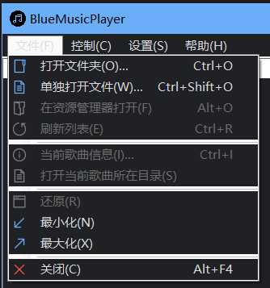
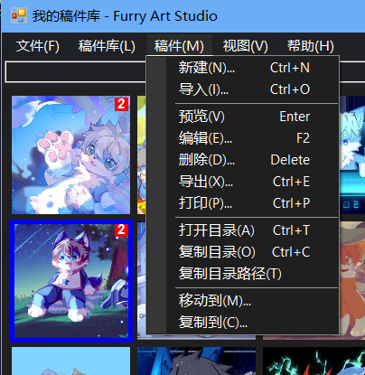
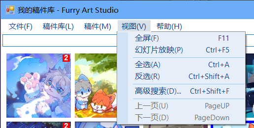
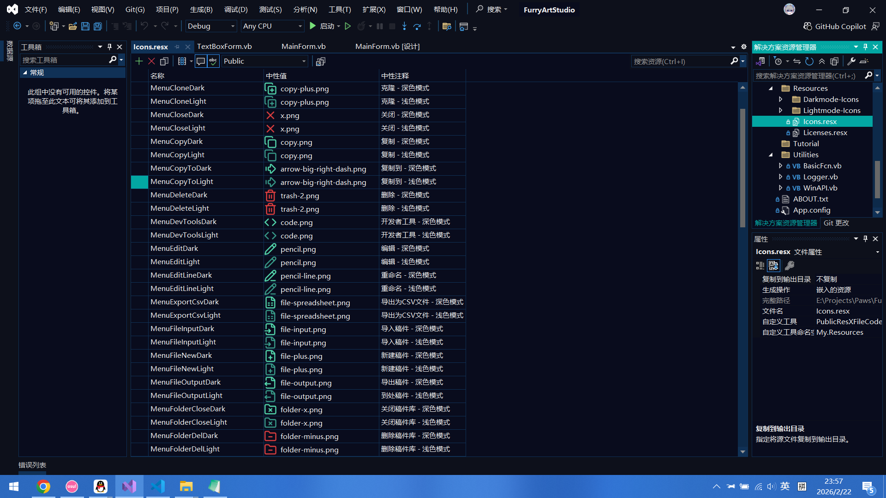
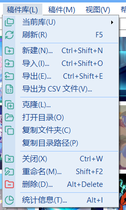
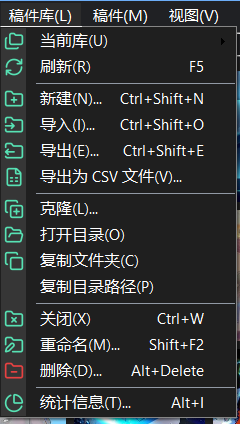
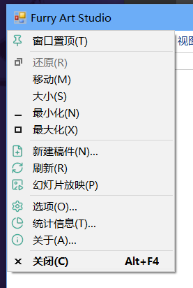
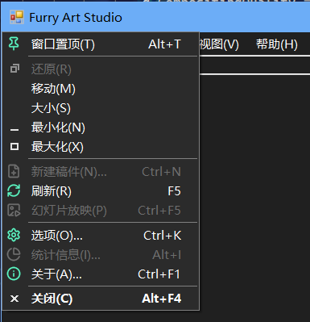

# FAS外观设计：菜单系统

本文我会介绍关于开源库的选用，菜单的图标选用，配色，以及部分WinAPI相关的内容，可能会有些难，请做好准备。

在我看来，Windows的**菜单系统**一直都是UI/UX的重点。

其实我本人更喜欢Win32 API去实现菜单，那种形式的菜单有一种系统原生的感觉，最主要支持**深色模式**，而使用VB.NET了，再去用太复杂的Win32 API有一种给了成品定制火砖，你却非要自己和水泥去制作一样。但后来我遇到的两个很重要的开源库，彻底改变了我这个程序的菜单开发。

首先，.NET的菜单虽然不支持原生的深色模式，但是它支持修改前景色和背景色实现深色模式，但我注意到它似乎无法改变分割线的颜色，如果我想要去改变，那就需要重写和继承分割线，那样代码变得很复杂：



于是我询问了万能的AI，有AI提供了一个好东西：`Krypton.Toolkit`

> [Krypton.Toolkit](https://github.com/Krypton-Suite/Standard-Toolkit) 是一个专门用于 .NET 桌面应用程序开发的第三方用户界面（UI）组件库。
>
> 简单来说，它是一套提供给 C# 或 VB.NET 程序员使用的“皮肤”和“控件集合”，目的是帮助开发者轻松创建出外观专业、现代且风格统一的 Windows 窗体应用程序。

*上述关于Krypton.Toolkit的介绍文本由AI生成。*

使用了`Krypton.Toolkit`后的程序变得相当漂亮，以下是实际效果：





对应的实现代码如下：

```vbnet
Imports Krypton.Toolkit

Public Class MainForm
'在MainForm上放置一个KryptonManager, 并命名为KryptonMgrMain
KryptonMgrMain.GlobalPaletteMode = PaletteMode.MaterialDark '深色主题
KryptonMgrMain.GlobalPaletteMode = PaletteMode.MaterialLight '浅色主题
End Class
```

这个工具的功能非常齐全，主题也有很多，尤其是对于深色模式来说，以及它对于菜单的无效，图标（后面会提到）等支持的同样很不错。

2月12日我开始决定设计图标，但是在那期间我解决一些个人私事，还顺便玩了一阵子蔚蓝，以及过年，所以没有太多精力，直到前不久才刚刚设计完成（2月18日）。

我首先找了我很久知道收藏的某个网站：[Icons8](https://icons8.com/icons)，它虽然免费，但是不允许二次分发，这意味着我的软件如果嵌入了他们的资源可能会违反[使用政策](https://intercom.help/icons8-7fb7577e8170/en/articles/5534926-universal-multimedia-license-agreement-for-icons8)。

于是我想到我之前了解过的一个开源项目[Everywhere](https://github.com/DearVa/Everywhere)，它使用的图标库是[Lucide](https://github.com/lucide-icons/lucide)，这个许可证比较松，它允许我将图标修改后嵌入到程序中。

由于图标是`SVG`格式，所以我让AI开发了一个转换脚本，将图标批量转换成`PNG`格式：

```python
#!/usr/bin/env python3
# -*- coding: utf-8 -*-

import os
import glob
from PIL import Image
import io
import subprocess
import tempfile

def delete_json_files():
    """删除当前文件夹下所有的JSON文件"""
    json_files = glob.glob("*.json")
    
    if not json_files:
        print("未找到JSON文件")
        return
    
    for json_file in json_files:
        try:
            os.remove(json_file)
            print(f"已删除: {json_file}")
        except Exception as e:
            print(f"删除 {json_file} 时出错: {e}")

def convert_svg_to_png_with_inkscape():
    """
    使用Inkscape命令行工具转换SVG（如果安装了Inkscape）
    """
    svg_files = glob.glob("*.svg")
    
    if not svg_files:
        print("未找到SVG文件")
        return False
    
    # 检查Inkscape是否可用
    try:
        subprocess.run(['inkscape', '--version'], capture_output=True, check=True)
        inkscape_available = True
    except (subprocess.CalledProcessError, FileNotFoundError):
        inkscape_available = False
    
    if not inkscape_available:
        print("Inkscape未安装，尝试其他方法...")
        return False
    
    for svg_file in svg_files:
        try:
            png_file = svg_file.replace('.svg', '.png')
            
            # 使用Inkscape命令行转换
            cmd = [
                'D:\\Program Files\\Inkscape\\bin\\inkscape',
                svg_file,
                '--export-type=png',
                f'--export-filename={png_file}',
                '--export-width=512',
                '--export-height=512'
            ]
            
            subprocess.run(cmd, check=True)
            print(f"已转换: {svg_file} -> {png_file} (512x512，使用Inkscape)")
            
        except Exception as e:
            print(f"转换 {svg_file} 时出错: {e}")
    
    return True

def convert_svg_to_png_with_wand():
    """
    使用Wand（ImageMagick绑定）转换SVG
    需要安装ImageMagick
    """
    try:
        from wand.image import Image as WandImage
        from wand.api import library
    except ImportError:
        print("请先安装Wand: pip install Wand")
        return False
    
    svg_files = glob.glob("*.svg")
    
    if not svg_files:
        return False
    
    for svg_file in svg_files:
        try:
            png_file = svg_file.replace('.svg', '.png')
            
            with WandImage(filename=svg_file) as img:
                img.resize(512, 512)
                img.save(filename=png_file)
            
            print(f"已转换: {svg_file} -> {png_file} (512x512，使用ImageMagick)")
            
        except Exception as e:
            print(f"转换 {svg_file} 时出错: {e}")
    
    return True

def convert_svg_to_png_with_reportlab():
    """
    使用ReportLab转换SVG（纯Python方案）
    """
    try:
        from reportlab.graphics import renderPM
        from svglib.svglib import svg2rlg
    except ImportError:
        print("请安装必要的库: pip install svglib reportlab")
        return False
    
    svg_files = glob.glob("*.svg")
    
    if not svg_files:
        return False
    
    for svg_file in svg_files:
        try:
            png_file = svg_file.replace('.svg', '.png')
            
            # 读取SVG
            drawing = svg2rlg(svg_file)
            
            # 缩放
            scale = min(512 / drawing.width, 512 / drawing.height)
            drawing.width = 512
            drawing.height = 512
            drawing.scale(scale, scale)
            
            # 渲染为PNG
            renderPM.drawToFile(drawing, png_file, fmt='PNG')
            
            print(f"已转换: {svg_file} -> {png_file} (512x512，使用纯Python方案)")
            
        except Exception as e:
            print(f"转换 {svg_file} 时出错: {e}")
    
    return True

def main():
    """主函数"""
    print("开始处理文件...")
    print("-" * 40)
    
    # 删除JSON文件
    print("步骤1: 删除JSON文件")
    delete_json_files()
    
    print("\n" + "-" * 40)
    
    # 转换SVG文件
    print("步骤2: 转换SVG文件为PNG")
    
    # 尝试多种转换方法
    if not convert_svg_to_png_with_inkscape():
        print("尝试使用ImageMagick方案...")
        if not convert_svg_to_png_with_wand():
            print("尝试使用纯Python方案...")
            if not convert_svg_to_png_with_reportlab():
                print("所有转换方法都失败了")
                print("\n请选择以下方案之一：")
                print("1. 安装Inkscape: https://inkscape.org/release/")
                print("2. 安装ImageMagick: https://imagemagick.org/script/download.php")
                print("3. 解决cairosvg的依赖问题（安装GTK+）")
    
    print("\n" + "-" * 40)
    print("处理完成!")

if __name__ == "__main__":
    main()
```

由于我的InkScape安装的目录问题，所以源程序存在部分改动。

随后我为我的程序设计了一套主题色，我感觉**海沫绿**非常符合我的软件的特征：它看起来自由，很清新，最终选定`#57E2B4`作为图标的主要颜色。

于是我使用Photoshop等工具，将图标由黑色又转换成对应的颜色。

很快我便意识到了问题：这个颜色在**深色模式**下是合格的（因为我常年使用深色模式），但是浅色模式下这个颜色变得非常难以辨认，于是AI为我挑选了一个新的颜色：`#3AA28F`。

于是我陷入了优化与体验的平衡：假设我只需要设置一套图标，那么就可以直接设置，最终图标会以二进制的方式存储在对应窗体设计器文件里，假设我想要让深色模式和浅色模式存在两套图标，那么就意味着我需要一个资源文件去管理它们，最终我选择了**后者**，比起优化我觉得体验更重要一些，尤其是我很喜欢我的配色在深色模式的菜单下近乎发光的效果。

后来我为深色和浅色都设计了一套图标，分别以这两种颜色为主题。

我让AI优化和编写了优雅的实现方式，尤其是对于菜单图标的处理。我最初设计的菜单图标是`512*512`的，但它们加载进图标会变得很大，于是就通过代码限制实际加载尺寸为32（在我的测试中，32已经是足够清晰的可以辨认的图标了，与512差不了太多）。

菜单项设置的代码如下：

```vbnet
Private Sub InitializeMenuImages(Optional isDarkMode As Boolean = False)
    Dim menuIcons As New List(Of (MenuItem As ToolStripMenuItem, BaseName As String)) From
{
    (MnuOnTop, "MenuPin"),
    (MnuDevTools, "MenuDevTools"),
    (MnuRunAsElevated, "MenuShield"),
    (MnuRunTerminal, "MenuTerminal"),
    (MnuProperties, "MenuSettings"),
    (MnuExit, "MenuClose"),
    (MnuLibList, "MenuFolders"),
    (MnuLibRefresh, "MenuRefresh"),
    (MnuLibNew, "MenuFolderNew"),
    (MnuLibImport, "MenuFolderInput"),
    (MnuLibExport, "MenuFolderOutput"),
    (MnuLibExportCSV, "MenuExportCsv"),
    (MnuLibClone, "MenuClone"),
    (MnuLibOpenFolder, "MenuFolderOpen"),
    (MnuLibCopy, "MenuCopy"),
    (MnuLibClose, "MenuFolderClose"),
    (MnuLibRename, "MenuFolderEdit"),
    (MnuLibDelete, "MenuFolderDel"),
    (MnuLibProperties, "MenuProperties"),
    (MnuMsNew, "MenuFileNew"),
    (MnuMsImport, "MenuFileInput"),
    (MnuMsView, "MenuView"),
    (MnuMsEdit, "MenuEdit"),
    (MnuMsExport, "MenuFileOutput"),
    (MnuMsPrint, "MenuPrint"),
    (MnuMsDelete, "MenuDelete"),
    (MnuMsOpenFolder, "MenuFolderOpen"),
    (MnuMsCopy, "MenuCopy"),
    (MnuViewPlay, "MenuImagePlay"),
    (MnuSearch, "MenuSearch"),
    (MnuPageUp, "MenuPrevious"),
    (MnuPageDown, "MenuNext"),
    (MnuHelpTutorial, "MenuTutorial"),
    (MnuHelpGithub, "MenuGithub"),
    (MnuHelpAbout, "MenuInfo"),
    (MnuHelpWhatsNew, "MenuStar")
}
    For Each setting In menuIcons
        Dim resourceName = setting.BaseName & If(isDarkMode, "Dark", "Light")
        Using img As Image = DirectCast(My.Resources.Icons.ResourceManager.GetObject(resourceName), Image)
            Dim size As Integer = 32 '图标尺寸
            Using thumb As New Bitmap(size, size)
                Using g = Graphics.FromImage(thumb)
                    g.InterpolationMode = InterpolationMode.HighQualityBicubic
                    g.SmoothingMode = SmoothingMode.HighQuality
                    g.PixelOffsetMode = PixelOffsetMode.HighQuality
                    g.CompositingQuality = CompositingQuality.HighQuality
                    g.DrawImage(img, 0, 0, size, size)
                End Using
                setting.MenuItem.Image = thumb.Clone '使用高质量缩略图
            End Using

        End Using
    Next
End Sub
```

对应的资源文件如下：



可以看到，深色模式的图标相比于浅色的**亮度会更亮一些**，同时右侧也展示了我的项目里图标，资源的存储路径和方式。

对于**危险的操作**，我使用了`#E84141`这个颜色，它看起来在深色和浅色下都足够醒目。

最终实现的菜单效果如下：




在软件自身的菜单设计完成后，我开始着手于程序窗口的**右键菜单**（系统菜单），因为很多专业的软件都会在这上面添加一些功能，典型的例子就是Google Chrome或Microsoft Edge，它们的标题栏右键会看到有很多新增的菜单，我的挑战就是在这里**新增我自己的菜单项**。

这是一个非常挑战WinAPI理解的问题。首先我们先定义对应的函数：

```vbnet
#Region "菜单"
    'GetSystemMenu 函数 - 获得系统菜单
    <DllImport("user32.dll")>
    Public Function GetSystemMenu(
        ByVal hwnd As IntPtr,
        ByVal bRevert As Boolean
    ) As IntPtr
    End Function
    'AppendMenu 函数 - 添加菜单项
    <DllImport("user32.dll", CharSet:=CharSet.Auto)>
    Public Function AppendMenu(
        ByVal hMenu As IntPtr,
        ByVal wFlags As Integer,
        ByVal wIDNewItem As Integer,
        ByVal lpNewItem As String
    ) As <MarshalAs(UnmanagedType.Bool)> Boolean
    End Function
    'RemoveMenu 函数 - 删除菜单项
    <DllImport("user32.dll")>
    Public Function RemoveMenu(
        ByVal hMenu As IntPtr,
        ByVal uPosition As Integer,
        ByVal uFlags As Integer
    ) As <MarshalAs(UnmanagedType.Bool)> Boolean
    End Function
    'CheckMenuItem 函数 - 选中/清除选中菜单项
    <DllImport("user32.dll")>
    Public Function CheckMenuItem(
        ByVal hMenu As IntPtr,
        ByVal uIDCheckItem As Integer,
        ByVal uCheck As Integer
    ) As Integer
    End Function
    'SetMenuItemBitmaps 函数 - 设置菜单位图
    <DllImport("user32.dll")>
    Public Function SetMenuItemBitmaps(
        ByVal hMenu As IntPtr,
        ByVal uPosition As Integer,
        ByVal uFlags As Integer,
        ByVal hBitmapUnchecked As IntPtr,
        ByVal hBitmapChecked As IntPtr
    ) As <MarshalAs(UnmanagedType.Bool)> Boolean
    End Function
    'EnableMenuItem 函数 - 使菜单在有效与无效之间切换
    <DllImport("user32.dll")>
    Public Function EnableMenuItem(
        ByVal hMenu As IntPtr,
        ByVal uIDEnableItem As Integer,
        ByVal uEnable As Integer
    ) As Integer
    End Function
    'GetMenuItemCount 函数 - 获取菜单项数量
    <DllImport("user32.dll")>
    Public Function GetMenuItemCount(
        ByVal hMenu As IntPtr
    ) As Integer
    End Function
    'InsertMenu 函数 - 插入菜单项
    <DllImport("user32.dll", CharSet:=CharSet.Auto)>
    Public Function InsertMenu(
        ByVal hMenu As IntPtr,
        ByVal nPosition As Integer,
        ByVal wFlags As Integer,
        ByVal wIDNewItem As Integer,
        <MarshalAs(UnmanagedType.LPTStr)> ByVal lpNewItem As String
    ) As <MarshalAs(UnmanagedType.Bool)> Boolean
    End Function
    'TrackPopupMenu 函数 - 弹出菜单
    <DllImport("user32.dll")>
    Public Function TrackPopupMenu(hMenu As IntPtr, uFlags As Integer, x As Integer, y As Integer, nReserved As Integer, hWnd As IntPtr, prcRect As IntPtr) As Integer
    End Function
    'GetMenuItemID 函数 - 获取菜单项ID
    <DllImport("user32.dll")>
    Public Function GetMenuItemID(
        ByVal hMenu As IntPtr,
        ByVal nPos As Integer
    ) As Integer
    End Function
    'SetMenuItemInfo 函数 - 设置菜单项信息
    <DllImport("user32.dll")>
    Public Function SetMenuItemInfo(hMenu As IntPtr, un As Integer, fByPosition As Boolean, <MarshalAs(UnmanagedType.Struct, SizeConst:=80)> ByRef lpmii As MENUITEMINFO) As Boolean
    End Function
    'GetMenuItemInfo 函数 - 获取菜单项信息
    <DllImport("user32.dll", CharSet:=CharSet.Auto)>
    Public Function GetMenuItemInfo(hMenu As IntPtr, uItem As Integer, fByPosition As Boolean, ByRef lpmii As MENUITEMINFO) As Boolean
    End Function
    'DeleteObject 函数 - 释放资源
    <DllImport("gdi32.dll")>
    Public Function DeleteObject(hObject As IntPtr) As Boolean
    End Function
    'MENUITEMINFO 结构体
    <StructLayout(LayoutKind.Sequential)>
    Public Structure MENUITEMINFO
        Public cbSize As Integer
        Public fMask As Integer
        Public fType As Integer
        Public fState As Integer
        Public wID As Integer
        Public hSubMenu As IntPtr
        Public hbmpChecked As IntPtr
        Public hbmpUnchecked As IntPtr
        Public dwItemData As IntPtr
        Public dwTypeData As String
        Public cch As Integer
        Public hbmpItem As IntPtr
    End Structure
    Public Const MIIM_BITMAP As Integer = &H80
    Public Const MIIM_TYPE As Integer = &H10
    Public Const MIIM_FTYPE As Integer = &H100
    Public Const MIIM_STRING As Integer = &H40
    Public Const MIIM_ID As Integer = &H2
    Public Const MFT_STRING As Integer = &H0
    '菜单常量
    Public Const MF_SEPARATOR = &H800 '分隔符
    Public Const MF_STRING = &H0 '字符串
    Public Const MF_BITMAP = &H4 '位图
    Public Const MF_GRAYED = &H1 '灰色菜单
    Public Const MF_ENABLED = &H0 '菜单可用
    Public Const MF_CHECKED = &H8 '勾选
    Public Const MF_UNCHECKED = &H0 '取消勾选
    Public Const MF_HILITE = &H80 '高亮
    Public Const MF_BYCOMMAND = &H0 '标识符
    Public Const MF_BYPOSITION = &H400 '位置
    '菜单项常量
    Public Const SC_RESTORE = &HF120 '还原
    Public Const SC_MOVE = &HF010 '移动
    Public Const SC_SIZE = &HF000 '大小
    Public Const SC_MINIMIZE = &HF020 '最小化
    Public Const SC_MAXIMIZE = &HF030 '最大化
    Public Const SC_CLOSE = &HF060 '关闭
    '菜单显示标识
    Public Const TPM_LEFTALIGN As Integer = &H0
    Public Const TPM_RETURNCMD As Integer = &H100

#End Region
```

我们**不一定**用到里面全部的API，但不少API是后续我们会使用的，这里补充两个关键细节：

1. `AppendMenu`函数只能在菜单的末尾**追加菜单**，不能在任意菜单项里插入新的菜单。更现代的实现方式是`InsertMenu`函数。
2. `SetMenuItemBitmaps`也是一个过时的API，现代的实现方式是`SetMenuItemInfo`，这个函数需要使用结构体，相对复杂一些。

我们通过这个方式，获得当前窗口的系统菜单句柄（这是对菜单操作的基础），随后我们在它的上面插入一个叫做`窗口置顶(&T)`的菜单项：

```vbnet
Private Const SC_ALWAYSONTOP = 1 '置顶菜单项标识符
Dim menuHandle = GetSystemMenu(Handle, False) '获取菜单句柄
InsertMenu(menuHandle, 0, MF_BYPOSITION Or MF_STRING, SC_ALWAYSONTOP, "窗口置顶(&T)")
```

在上面的代码中：
 - `Handle`是当前窗口的句柄，这里其实是一个语法糖，也就是**当前窗口的代码**里我们可以直接用`Handle`代替`Me.Handle`的写法
 - `menuHandle`是我们获得的菜单句柄，在第二条语句里我们在这上面进行操作
 - `0`意味着我们在菜单的最上面（实际是在`还原(&R)`菜单的**上方**）插入一条菜单
 - `MF_BYPOSITION Or MF_STRING`是固定标识符，表示我们插入的是一个字符串，如果是分割线，应该写作`MF_BYPOSITION Or MF_SEPARATOR`
 - `SC_ALWAYSONTOP`就是我们新定义的菜单的标识符，这里标识符不应该和系统菜单自带的（例如`SC_RESTORE`）冲突，**这个标识符很重要，不仅是为了方便维护，后面我们仍然需要借助这个常量**。

于是，我们成功在菜单上添加了一个窗口置顶的菜单项，但是它现在点是没有任何效果的，因为我们的程序还不知道它的事件，这时候需要我们添加如下代码：

```vbnet
Protected Overrides Sub WndProc(ByRef m As Message) '窗体消息处理函数
    If m.Msg = WM_SYSCOMMAND Then '窗体响应菜单
        Dim hMenu = GetSystemMenu(Handle, False)
        Select Case m.WParam.ToInt32'对应菜单标号
            Case SC_ALWAYSONTOP '窗口置顶
                If TopMost = False Then
                    TopMost = True
                    CheckMenuItem(hMenu, SC_ALWAYSONTOP, MF_CHECKED) '窗口置顶
                Else
                    TopMost = False
                    CheckMenuItem(hMenu, SC_ALWAYSONTOP, MF_UNCHECKED) '取消置顶
                End If
        End Select
    End If
    MyBase.WndProc(m) '循环监听消息
End Sub
```

我们这里通过监听窗口的**系统命令**（`WM_SYSCOMMAND`）消息，从而得知用户激活了菜单，并且我们将我们的菜单标识符传入，就可以监听用户点击菜单的事件了，这里我们通过`CheckMenuItem`来设置菜单项的勾选效果与取消勾选。

关于图标，我看到AI编写的使用`SetMenuItemInfo`设置的图标，但是代码太复杂了，这里以简单的`SetMenuItemBitmaps`为例：

首先，Win32菜单图标类型与.NET的图标类型不一样，要想使用，必须经过**类型转换**，并且根据函数定义我们需要传递图标的**句柄指针**。

图标应该按照Windows应用的范式开发，我这里选择的图标尺寸为18，并且我遇到一个问题：在VB.NET下的`Color.Transparent`虽然是透明色，但实际因为转换类型的原因，图标**不是完全的透明**，自身存在锯齿，甚至在鼠标掠过时还会突然变白，因此我想到了一种曲线救国的方式：

```vbnet
    ''' <summary>
    ''' 为指定的菜单项设置图标, 并处理透明度背景模拟
    ''' </summary>
    ''' <param name="hMenu">菜单句柄(hMenu)</param>
    ''' <param name="wParam">菜单项标识符(wParam)</param>
    ''' <param name="icon">原始图标资源</param>
    ''' <param name="isDarkMode">是否为深色模式</param>
Public Sub ApplyMenuIcon(hMenu As IntPtr, wParam As Integer, icon As Bitmap, Optional isDarkMode As Boolean = False)
    '释放旧的位图句柄
    Dim mii As New MENUITEMINFO With {
        .cbSize = Marshal.SizeOf(Of MENUITEMINFO)(),
        .fMask = MIIM_BITMAP
    }
    If GetMenuItemInfo(hMenu, wParam, False, mii) Then
        If mii.hbmpItem <> IntPtr.Zero Then
            DeleteObject(mii.hbmpItem)
        End If
    End If
    '创建新位图并设置
    Dim size As Integer = 18 '图标尺寸
    Using resizedBmp As New Bitmap(size, size, PixelFormat.Format24bppRgb)
        Using g As Graphics = Graphics.FromImage(resizedBmp) '设置高质量缩放参数
            g.InterpolationMode = InterpolationMode.HighQualityBicubic
            g.SmoothingMode = SmoothingMode.HighQuality
            g.PixelOffsetMode = PixelOffsetMode.HighQuality
            g.CompositingQuality = CompositingQuality.HighQuality
            '清空背景, 并按照主题填充
            If isDarkMode Then
                g.Clear(Color.FromArgb(43, 43, 43))
            Else
                g.Clear(SystemColors.Menu)
            End If
            '计算保持宽高比的绘制区域
            Dim srcWidth As Integer = icon.Width
            Dim srcHeight As Integer = icon.Height
            '计算缩放比例
            Dim ratio As Double = Math.Min(size / srcWidth, size / srcHeight)
            Dim newWidth As Integer = CInt(srcWidth * ratio)
            Dim newHeight As Integer = CInt(srcHeight * ratio)
            Dim x As Integer = (size - newWidth) \ 2
            Dim y As Integer = (size - newHeight) \ 2
            g.DrawImage(icon, New Rectangle(x, y, newWidth, newHeight), 0, 0, srcWidth, srcHeight, GraphicsUnit.Pixel)
        End Using '绘制缩放后的图像
        Dim hBitmap = resizedBmp.GetHbitmap()
        SetMenuItemBitmaps(hMenu, wParam, MF_BYCOMMAND, hBitmap, Nothing)
    End Using
End Sub
```

**注意：这里我使用了一个深色主题参数，因为我们需要知道菜单的背景颜色，这样我们可以绘制外观上看不出来的菜单图标并设置，但需要注意，这种“透明”实际上并不是真的透明，只是一种妥协的方案。**

随后在代码里使用：

```vbnet
Dim menuHandle = GetSystemMenu(Handle, False) '设置窗体菜单句柄
If isDarkMode Then
    ApplyMenuIcon(menuHandle, SC_ALWAYSONTOP, My.Resources.Icons.MenuPinDark, True)
Else
    ApplyMenuIcon(menuHandle, SC_ALWAYSONTOP, My.Resources.Icons.MenuPinLight)
End If
```

最后通过API设置组合键内容的显示，深色模式，勾选状态，无效状态等，我们就得到了实际的菜单，效果如下：



*其实这张图是比较早时候的截图了，后来我添加了组合键的支持以及菜单无效状态，新的效果如下（深色模式）：



关于菜单的图标配色，我其实是故意这么选择的，因为这样才可以让用户觉得菜单也是程序的一部分，从而更喜欢我的产品，尤其是深色模式的菜单图标，看起来更灵动，我本人就非常喜欢这种夜里发光的效果，它看起来特别好看，给人一种有希望的感觉。

关于菜单的设计就到这里了，下一个博客我会讲解关于主题适配方面的内容。