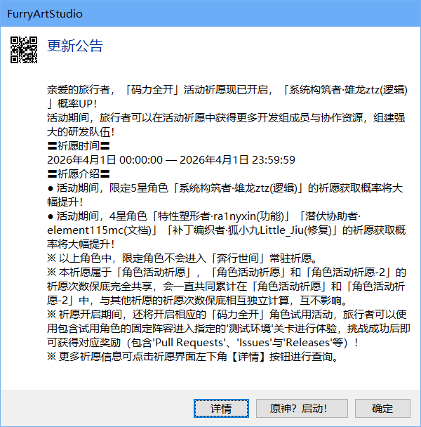

# FAS彩蛋设计：贡献者

## 前言

很多软件都有自己的彩蛋文化，比如最著名的就是出现在**微软Office**早期部分产品的内部。这篇来自[量子位](https://space.bilibili.com/673779175)投稿的[视频](https://www.bilibili.com/video/BV1oz42187Yg)简单讲述了彩蛋的发展史，感兴趣的朋友可以去看一看（*非有偿推广*）。

为了给我自己的FAS里藏一个彩蛋，我发现可以选择在**4月1日愚人节**之前发布。前不久我迁移了新的[仓库地址](https://github.com/PawLaboratory/FurryArtStudio)，而直到愚人节前夕我的项目[Contributors](https://github.com/PawLaboratory/FurryArtStudio/graphs/contributors)也只有四位，为了感谢那些一直陪伴我开发的成员（即使有些成员可能贡献较少，但仍然进行了实际付出），我决定编写一个**FurryArtStudio的彩蛋代码**：

```vbnet
Public Class Artifacts
    ''' <summary>
    ''' 2026 愚人节代码
    ''' </summary>
    Public Shared Sub AprilFools2026()
        If Now.Month = 4 And Now.Day = 1 Then
            Dim giWishContent As String = "
亲爱的旅行者，「码力全开」活动祈愿现已开启，「系统构筑者·雄龙ztz(逻辑)」概率UP！
活动期间，旅行者可以在活动祈愿中获得更多开发组成员与协作资源，组建强大的研发队伍！
〓祈愿时间〓
2026年4月1日 00:00:00 — 2026年4月1日 23:59:59
〓祈愿介绍〓
● 活动期间，限定5星角色「系统构筑者·雄龙ztz(逻辑)」的祈愿获取概率将大幅提升！
● 活动期间，4星角色「特性塑形者·ra1nyxin(功能)」「潜伏协助者·element115mc(文档)」「补丁编织者·狐小九Little_Jiu(修复)」的祈愿获取概率将大幅提升！
※ 以上角色中，限定角色不会进入「奔行世间」常驻祈愿。
※ 本祈愿属于「角色活动祈愿」，「角色活动祈愿」和「角色活动祈愿-2」的祈愿次数保底完全共享，会一直共同累计在「角色活动祈愿」和「角色活动祈愿-2」中，与其他祈愿的祈愿次数保底相互独立计算，互不影响。
※ 祈愿开启期间，还将开启相应的「码力全开」角色试用活动，旅行者可以使用包含试用角色的固定阵容进入指定的'测试环境'关卡进行体验，挑战成功后即可获得对应奖励（包含'Pull Requests'、'Issues'与'Releases'等）！
※ 更多祈愿信息可点击祈愿界面左下角【详情】按钮进行查询。
"
            Dim buttonInfo As New TaskDialogButton("详情")
            Dim buttonGi As New TaskDialogButton("原神？启动！")
            Using dlg As New TaskDialog With {
            .WindowTitle = My.Resources.FurryArtStudio,
            .MainInstruction = "更新公告",
            .Content = giWishContent,
            .CustomMainIcon = Icon.FromHandle(My.Resources.Icons.RickRollQRCode.GetHicon)
            }
                dlg.Buttons.Add(buttonInfo)
                dlg.Buttons.Add(buttonGi)
                dlg.Buttons.Add(New TaskDialogButton(ButtonType.Ok))
                Dim result As TaskDialogButton = dlg.ShowDialog()
                If result Is buttonInfo Then
                    Process.Start("https://github.com/PawLaboratory/FurryArtStudio")
                End If
                If result Is buttonGi Then
                    Process.Start("https://ys.mihoyo.com/")
                End If
            End Using
        End If
        '藏着么深应该没人注意到吧, 嘻嘻
        '这段代码写的有点乱, 有空重构好了
        '测试了下二维码应该是可以扫描的, 如果扫不了得换更高DPI的显示器
        '应该没人注意到是什么
    End Sub
End Class
```

这是一个很有意思的函数，它可以使用`Ookii.Dialogs.WinForms`这个库来弹出一个[任务对话框](https://learn.microsoft.com/en-us/windows/win32/controls/task-dialogs-overview)，它相比于传统的`MsgBox()`或`MessageBox.Show()`要具有更多的特性：按钮自定义，图标自定义等。

接下来我会详细为各位解释一下这段代码。

## 实现方式



如题，为了弹出一个这样的对话框，需要我们的操作系统为Windows7及以上，可以通过WindowsAPI的方式调用，但是很麻烦，[Ookii Dialogs](https://github.com/ookii-dialogs)为我们提供了解决方案。`Ookii Dialogs`虽然不再更新了，但是它还可以使用，而且作者开发了WPF和WinForms两个版本。我们的项目是WinForms，所以在NuGet里导入这个包即可。

首先，我们从[米游社](https://www.miyoushe.com/ys/article/62708136)找到一个原神的版本更新内容（其实下面这个文案也是社区二创，而不是官方的）：

```text
亲爱的旅行者，「穹理翊筑」活动祈愿现已开启，限定6星角色「天穹之镜·卡维(草) 」概率UP！
〓祈愿时间〓
2025/07/09  00：00～永久
〓祈愿介绍〓
●活动期间，限定6星角色「天穹之镜·卡维(草)」的祈愿获取概率将大幅提升!
●活动期间，5星角色「诲韬诤言·艾尔海森(草)」 「缄秘的裁遣·赛诺(雷)」 「浅蔚轻行·提纳里(草) 」祈愿获取概率将大幅提升!
※以上角色中，限定角色均进入「奔行世间」常驻祈愿。
※本祈愿属于「角色活动祈愿-2」,「角色活动祈愿」和「角色活动祈愿-2」的祈愿次数保底完全共享，会一直共同累计在「角色活动祈愿」和「角色活动祈愿-2」中，与其他祈愿的祈愿次数保底相互独立计算，互不影响。
※从本次「角色活动祈愿-2」起，复刻5星和全新6星角色均有可能出现在「角色活动祈愿-2」。
※祈愿开启期间，还将开启相应的「且试身手」角色试用活动，旅行者可以使用包含试用角色的固定阵容进入指定的关卡进行体验，挑战成功后即可获得对应奖励!
※更多祈愿信息可点击祈愿界面左下角【详情】按钮进行查询
```

然后我们去掉其余的无用信息，按照格式重新填写一套字段，比如原神的角色始终为`角色称号·名称(属性)`，例如`仙蕊玲珑·瑶瑶(草)`，然后我根据我的项目的贡献者，以及贡献的内容进行一个总结，并赋予他们专属称号。

[@xionglongztz](https://github.com/xionglongztz)是我本人，也是项目主要构建者，所以我是五星角色。其余帮过我的朋友如下：

 - [@ra1nyxin](https://github.com/ra1nyxin)帮我完善部分WinAPI函数以及文档内容。
 - [@LittleJiu-furry](https://github.com/LittleJiu-furry)帮我完善部分边界条件，以及优化。
 - [@element115mc](https://github.com/element115mc)帮我完善了英文版本的`README_EN.md`文档

这三人都是我的亲友，刚好符合原神版本更新文案的空白处，于是我完善了文案。

剩下就是一些条件判断了，例如：`If Now.Month = 4 And Now.Day = 1 Then`这段代码为判断当前日期是否为愚人节。

然后就是对话框的初始化：

```vbnet
Using dlg As New TaskDialog With {
            .WindowTitle = My.Resources.FurryArtStudio,
            .MainInstruction = "更新公告",
            .Content = giWishContent,
            .CustomMainIcon = Icon.FromHandle(My.Resources.Icons.RickRollQRCode.GetHicon)
            }
```
其中：

 - `WindowTitle`为对话框标题，也就是软件标题
 - `MainInstruction`为主要操作，对应的就是蓝色文本
 - `Content`为正文部分，也就是文案本身的内容
 - `CustomMainIcon`是一个自定义图标的参数，我通过传参加了一个[RickRoll](https://www.bilibili.com/video/BV1GJ411x7h7)的二维码

随后添加按钮与显示对话框，获得它的返回值，返回值是按钮类型，可以通过对象判断来确定我们按下的按钮，从而执行操作，比如打开原神官网或者打开项目地址。

另外你可能注意到我给这个类命名为`Artifacts`，它的意思是**人工制品，遗物**。在原神里也就是**圣遗物**的英文。这是一个巧合，我其实可以使用**Legacy**这样的词，但是我觉得这个词放在这里很有意思，因为这段代码理论上今年用过了我就再也不会使用了，我会在明年设计一个新的愚人节内容，但直接删除比较可惜，我会把它放在这个**遗物**类，以后如果有用户希望自己编译，还可以复现那些以前的彩蛋。

以及，各位可能还有一个没有注意的地方，当对着对话框焦点按下`Ctrl+C`时，可以**复制**对话框的全部内容：

```text
[Window Title]
FurryArtStudio

[Main Instruction]
更新公告

[Content]

亲爱的旅行者，「码力全开」活动祈愿现已开启，「系统构筑者·雄龙ztz(逻辑)」概率UP！
活动期间，旅行者可以在活动祈愿中获得更多开发组成员与协作资源，组建强大的研发队伍！
〓祈愿时间〓
2026年4月1日 00:00:00 — 2026年4月1日 23:59:59
〓祈愿介绍〓
● 活动期间，限定5星角色「系统构筑者·雄龙ztz(逻辑)」的祈愿获取概率将大幅提升！
● 活动期间，4星角色「特性塑形者·ra1nyxin(功能)」「潜伏协助者·element115mc(文档)」「补丁编织者·狐小九Little_Jiu(修复)」的祈愿获取概率将大幅提升！
※ 以上角色中，限定角色不会进入「奔行世间」常驻祈愿。
※ 本祈愿属于「角色活动祈愿」，「角色活动祈愿」和「角色活动祈愿-2」的祈愿次数保底完全共享，会一直共同累计在「角色活动祈愿」和「角色活动祈愿-2」中，与其他祈愿的祈愿次数保底相互独立计算，互不影响。
※ 祈愿开启期间，还将开启相应的「码力全开」角色试用活动，旅行者可以使用包含试用角色的固定阵容进入指定的'测试环境'关卡进行体验，挑战成功后即可获得对应奖励（包含'Pull Requests'、'Issues'与'Releases'等）！
※ 更多祈愿信息可点击祈愿界面左下角【详情】按钮进行查询。


[详情] [原神？启动！] [确定]
```

这也是我使用了Windows操作系统多年才知道的冷知识，而且这是系统**原生功能**，下次遇到报错的时候，完全可以直接按下`Ctrl+C`，而不是使用OCR等外部工具识别了。

需要说明，上面复制对话框的方式，对于`MsgBox()`以及其他**系统对话框**都是有效的，但对于很多**自绘对话框**来说可能没有任何作用。

这里也有个我很喜欢的地方，我个人非常喜欢那些与系统集成度紧密的东西，例如我不喜欢**自绘窗体或者偏离系统操作风格过大的窗体**（例如某些音乐播放器，游戏启动器等应用），它不能和系统窗体保持统一的风格，甚至不能兼容操作系统的**无障碍模式**，这给我一种程序不好好遵守操作系统规定的感觉，甚至有些**冒犯**。

以上就是FurryArtStudio的愚人节部分彩蛋代码全解析了，如果你感兴趣，欢迎去[原始仓库](https://github.com/PawLaboratory/FurryArtStudio)查看更多细节，也非常欢迎您一键三连（Watch，Fork和Star）。

*创作于2026-4-2*