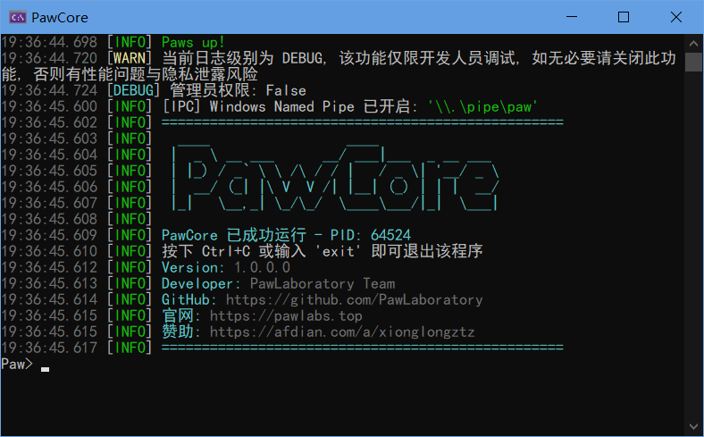

# 关于Paw系列暂停开发与新项目的启动

我先前正在秘密开发一款项目，叫做`PawManager`，不过目前在开发后端时遇到了瓶颈。

后端采用VB.NET Core技术栈开发，它是一个控制台程序，类似于Java版Minecraft服务端一样，它支持使用控制台指令（例如手动查询数据库，修改或删除项），IPC连接（例如Windows的Named Pipe，Linux等系统的Unix Domain Socket），以及WebSocket连接（通过网络栈）进行自动化处理。

不过，在我开发的过程中遇到了问题：dotnet的`Console`类的`ReadLine`函数没有办法正确的捕获Ctrl+C信号，我通过一些奇技淫巧实现了这一个功能：

```vbnet
' ConsoleHostedService.vb
Public Async Function ReadLineAsync(token As CancellationToken) As Task(Of String)
    Return Await Task.Run(Function() As String
                              '在用户开始打字前，我们可以不断检查是否需要取消
                              While Not token.IsCancellationRequested
                                  If Console.KeyAvailable Then
                                      '一旦发现用户按了任意键, 就进入系统原生的 ReadLine
                                      '此时系统接管输入, 支持上下键历史与 Tab 补全等
                                      Return Console.ReadLine()
                                  End If
                                  '稍微休眠, 避免 CPU 占用过高
                                  Thread.Sleep(50)
                              End While
                              '如果循环结束是因为 token 取消
                              Return Nothing
                          End Function, token)
End Function
```

这么做表面看是解决了问题，不过还是有些问题在里面，尤其是将来可能的技术债。

于是我开始从另一个重要的方向，也就是IPC方面开发，先从Windows支持开始，但我发现这是一个系统的工程，我需要为将来的不少设计铺路，短期来看也不是什么容易的方法，更何况我其实很不喜欢JSON，因为JSON稍不注意格式就会出错，本身不是人类可读。所以从必走的另一条路线来看也是很难实现的，这是由于我自身的局限性导致的，就像是一个闯关游戏卡关了一样。

于是我做了一个大胆的决定：**暂停开发`PawCore`，专注于开发另一个工具**：`FurryArtStudio`（简称`FAS`）。

相比于`Paw`系列，`FAS`与前者的架构有很大的不同，这让一个几乎不可能的任务变得比较容易实现：

| 维度 | PawManager | FurryArtStudio |
| ---- | ---------- | --------------- |
| 架构 | 基于VB.net Core扩展 | **仅VB.net WinForms** |
| 技术栈 | WinForms窗体应用 | 控制台应用 |
| 难度 | **极高** | 相对容易 |
| 数据库支持 | 所有主流SQL数据库（SQLite，PostgreSQL，SQL Server，MySQL） | **仅SQLite** |
| 跨平台支持 | **是** | 否 |
| 插件支持 | **支持**（在将来的版本中） | 不支持 |
| 跨节点互联 | **支持** | 不支持 |
| 第三方客户端 | **支持** | 不支持 |
| 用户友好度 | 一般（需要有一定的技术基础） | **极好** |
| 多稿件库功能 | 支持 | 支持 |
| 备份功能 | **支持**（需要插件） | 不支持 |
| 格式支持 | 支持主流图片格式以及额外功能（需要插件） | 仅支持主流图片格式 |
| 历史版本 | **支持**（需要插件或后续更新） | 不支持 |

这个决定其实我很久之前就想搞了，因为根据我的调查，几乎所有画师的主流工具是Windows操作系统（少数可能使用安卓版本），并且Paw系列的绝大多数功能对于普通画师来说可能用不上，而且会增加他们的操作成本，我制作和使用这个工具，前提是我习惯于整理自己的数字资料，而我为了让画师能够使用我的工具，而不是重命名文件和新建文件夹，这对于我的新项目来说也是一种挑战，需要给画师和普通用户养成这种习惯。

另外，对于安卓版本开发，我暂时还没有打算，因为我本人还没了解过安卓端开发，这部分我会通过暴露IPC接口的方式，由其他社区内成员来开发安卓端的第三方客户端吧。

我会秉持着开源，免费的方式去开发和设计我的应用，我不会售卖源代码，同时我也会尽可能申请代码签名，软著，LOGO商标等等来维护我的权益。

关于新的项目的Splash，我考虑找画师绘制并购买商业版权，通过一个原创的“兽”作为品牌商标，Slogan就叫“我的稿件我做主”怎么样？感觉可能有点土，但是就这样吧，我不指望它真的火起来，要是我的项目GitHub真的有10K个Star我都谢天谢地了（笑）。

目前几乎所有项目都是Private权限，直到我成功开发出能用的版本，我才会公开发布。这段时间除了软件本身逻辑，下一步就是开发我自己的VB.net WinForms组件`PawUI`项目了，这个项目在将来可以在`PawManager`以及`FurryArtStudio`都能利用上。

目前的PawCore外观如下，隐藏了部分信息到`info`命令中：

